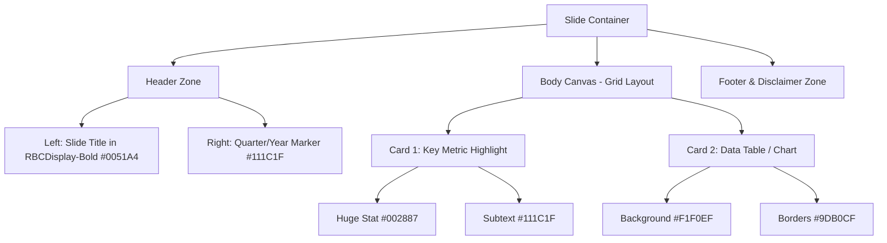

# RBC Investor Presentation Visual Identity & Design Guide

This guide details the official visual identity, color palettes, typography, and layout schemas used by the **Royal Bank of Canada (RBC)** in their quarterly investor presentations and public stakeholder calls (analyzed from Q2 2026 and Q4 2025 official materials).

---

## 1. Color Palette

The RBC color palette is clean, high-contrast, and professional, blending their traditional blue and gold heritage with modern, soft grays for digital layouts.

### Primary Brand Colors

| Swatch | Color Name | HEX Code | RGB | Primary Use |
| :--- | :--- | :--- | :--- | :--- |
| 🔵 | **RBC Classic Blue** | `#0051A4` | `rgb(0, 81, 164)` | Headers, slide titles, hero backgrounds, primary buttons |
| 🟡 | **RBC Gold** | `#FDDF00` | `rgb(253, 223, 0)` | Accent borders, highlighted numbers, callouts |

### Typography & Text Colors

| Swatch | Color Name | HEX Code | RGB | Primary Use |
| :--- | :--- | :--- | :--- | :--- |
| ⚫ | **Deep Charcoal** | `#111C1F` | `rgb(17, 28, 31)` | Body copy, secondary headers, table data |
| 🔵 | **Deep Navy** | `#002887` | `rgb(0, 40, 135)` | Highlighted numbers, metric labels |
| ⚪ | **Pure White** | `#FFFFFF` | `rgb(255, 255, 255)` | Text on dark backgrounds, table headers |

### Backgrounds & Containers

| Swatch | Color Name | HEX Code | RGB | Primary Use |
| :--- | :--- | :--- | :--- | :--- |
| ⚪ | **Off-White / Warm Gray** | `#F1F0EF` | `rgb(241, 240, 239)` | Soft background panels, card containers |
| 🔵 | **Ice Blue** | `#EDF4F6` | `rgb(237, 244, 246)` | Alternate panel backgrounds, key takeaway cards |

### Accent & Chart Colors

| Swatch | Color Name | HEX Code | RGB | Primary Use |
| :--- | :--- | :--- | :--- | :--- |
| 🔵 | **Vibrant Blue** | `#006AC3` | `rgb(0, 106, 195)` | Positive growth charts, secondary highlights |
| 🌐 | **Sky Blue** | `#0091DA` | `rgb(0, 145, 218)` | Secondary series in charts |
| 🔗 | **Muted Slate** | `#9DB0CF` | `rgb(157, 176, 207)` | Gridlines, borders, neutral data series |
| 🟡 | **Warm Gold** | `#FFC62C` | `rgb(255, 198, 44)` | Highlighted icons, warning indicators |

---

## 2. Typography

RBC uses a custom, proprietary sans-serif font family to establish a distinct, modern digital presence.

### Core Typeface
* **Font Family:** `RBCDisplay`
* **Weights & Styles Used:**
  * `RBCDisplay-Bold`: Used for slide titles, large statistics, and section headings.
  * `RBCDisplay-Medium`: Used for sub-headers, table titles, and emphasized inline text.
  * `RBCDisplay-Regular`: Used for general paragraph text, details, footnotes, and table content.
  * `RBCDisplay-Italic`: Used for legal disclaimers, notes, and sources at the bottom of slides.

### Fallback Web & Slide Stacks
When `RBCDisplay` is unavailable, RBC projects fallback to clean system sans-serif typefaces to maintain hierarchy:
* **MacOS/iOS Fallback:** `SF Pro Display`, `-apple-system`
* **Windows/Android Fallback:** `Segoe UI`, `Arial`, `Helvetica`
* **Monospace Fallback:** `Courier New`, `Courier` (used strictly for tabular data where alignment is crucial)

---

## 3. Slide Layout & Structural Schemas

The presentations utilize a structured, grid-based card layout that helps organize dense financial tables and metrics cleanly.

### Layout Elements
1. **Title Banner (Slide Header):**
   * Placed at the top-left of the slide.
   * Format: Large, left-aligned title in `#0051A4` (RBC Classic Blue) using `RBCDisplay-Bold`.
   * Underline: A thin horizontal dividing rule in `#9DB0CF` (Muted Slate) or `#FDDF00` (RBC Gold) separates the header from the content.
2. **Divided Column Layouts:**
   * Slides are typically divided into 2 or 3 equal-width columns.
   * Columns are represented as "Cards" using soft container backgrounds (`#F1F0EF` or `#EDF4F6`) with small border radiuses (~4px to 8px) to bundle related information together.
3. **Data Representation (Tables & Charts):**
   * **Tables:** Header row is dark blue (`#0051A4` or `#002887`) with white text. Data rows alternate backgrounds or use clean `#9DB0CF` borders. Text is right-aligned for numbers, left-aligned for labels.
   * **Charts:** Bar charts utilize `#0051A4` as the baseline color, `#0091DA` as the secondary comparison, and `#FDDF00` for callouts (e.g. highlighting target achievements).
4. **Slide Footers (Bottom Margins):**
   * Contains slide page numbers, date stamps, and regulatory notes in very small size (~8pt) using `RBCDisplay-Italic` in `#6E8DB8` (Muted Slate) or `#111C1F` (Charcoal).

---

## 4. Charting & Data Visualization Identity

RBC presentations use highly structured charting practices to display trend lines, bar charts, and data matrices:

### Column / Bar Chart Styling
1. **Focus Highlighting:** In comparative trend charts (e.g. 5-quarter sequences), historical quarters use the neutral **Muted Slate (`#9DB0CF`)**, while the active/current quarter is highlighted in the vibrant **RBC Classic Blue (`#0051A4`)** to draw immediate focus.
2. **Value Labels:** Data value labels are placed outside the bars at the top, colored in `#111C1F` (Charcoal) with a font size of ~10pt.
3. **Data Spacing:** Bar widths are set to ~0.6 of the category spacing, leaving 0.4 as empty margin to ensure a clean layout.

### Line Chart & Vintage Curve Styling
1. **Trend Lines:** Line charts use a standard weight of `2pt` for historical comparative lines, while active/key cohorts use a bold `3pt` line.
2. **Markers:** Standard data points use simple solid circle markers (`o`). The final/terminal value of the key cohort is emphasized using a gold star marker (`*`) in `#FDDF00`.
3. **Axes & Grids:** Vertical and horizontal axes are drawn in light gray (`#CCCCCC`) or muted slate. Gridlines are thin (`0.5pt`), dashed, and set in a light neutral gray (`#E0E0E0`).

### Stacked Column Series (Hierarchical Colors)
When representing multiple categories stacked vertically, the series colors are layered in the following order (from base to top):
1. **Base:** `#003068` (Deep Navy)
2. **Level 2:** `#0051A4` (RBC Classic Blue)
3. **Level 3:** `#6E8DB8` (Muted Steel Blue)
4. **Top:** `#0091DA` (Sky Blue)

---

## 5. Bullet & Detail Lists Hierarchy
To manage text density on slides, bullet points follow a strict indent and symbol structure:
* **Level 1 Bullet:** Square symbol `▪` (rendered in `Wingdings-Regular`, color `#0051A4`, size `11pt`)
* **Level 2 Bullet:** Plus `+` or minus `−` symbols (rendered in `SymbolMT`, color `#0051A4`, size `11pt`) to indicate positive/negative drivers or offsets.
* **Level 3 Bullet:** Hollow circle `o` (rendered in `CourierNewPSMT`, color `#0051A4`, size `11pt`)

---

## 6. Digital Assets & References

The analysis was performed on the following official source PDFs:
1. **Q2 2026 Earnings Presentation:** [2026q2slides.pdf](file:///C:/Users/andre/.gemini/antigravity-ide/brain/97b11191-4359-4943-a2fe-8d27db76a932/scratch/q2_2026.pdf)
2. **Q4 2025 Earnings Presentation:** [2025q4slides.pdf](file:///C:/Users/andre/.gemini/antigravity-ide/brain/97b11191-4359-4943-a2fe-8d27db76a932/scratch/q4_2025.pdf)
3. **RBC Matplotlib Style Generator:** [rbc_chart_generator.py](file:///C:/Users/andre/.gemini/antigravity-ide/brain/97b11191-4359-4943-a2fe-8d27db76a932/scratch/rbc_chart_generator.py)
4. **Generated RBC Style Chart Demo:** [rbc_vintage_curve_demo.png](file:///C:/Users/andre/New_projects/Gemini/student%20line%20of%20credit/images/rbc_vintage_curve_demo.png)
